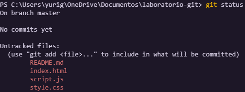
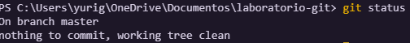
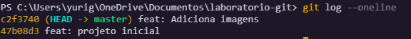
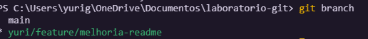
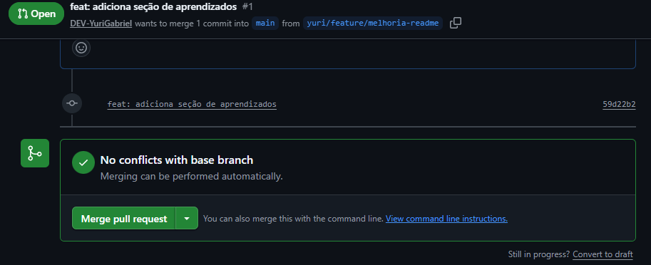
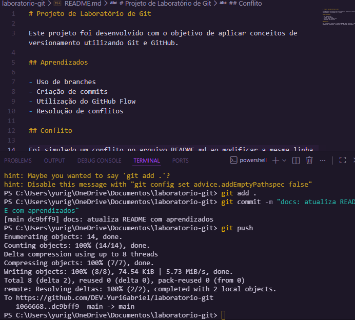
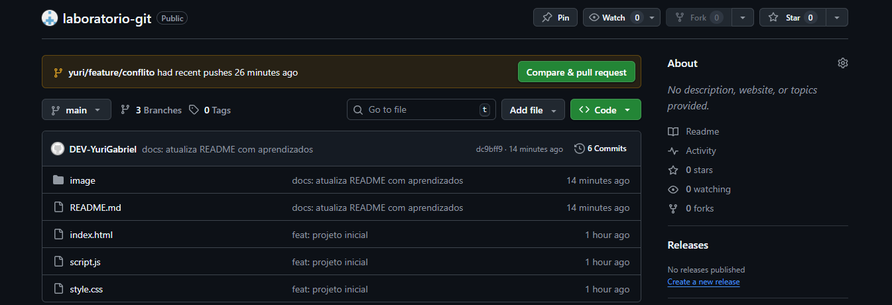

# Projeto de Laboratório de Git

## 📌 Objetivo
Aplicar conceitos de versionamento utilizando Git e GitHub.

---

## 📸 Evidências

### 🔹 Git Status (Antes)

---

### 🔹 Git Status (Depois)

---

### 🔹 Git Log (--oneline)

---

### 🔹 Criação da Branch

---

### 🔹 Pull Request

---

### 🔹 Conflito

---

### 🔹 Conflito Resolvido

---

### 🔹 Repositório Final

---

## 🧠 Aprendizados

- Uso de branches  
- Commits  
- GitHub Flow  
- Resolução de conflitos  

---

## ⚠️ Conflito

Foi simulado um conflito no arquivo README.md ao modificar a mesma linha em branches diferentes. O conflito foi resolvido manualmente.